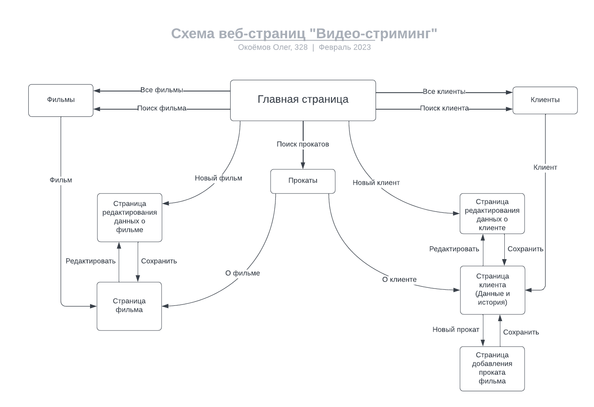
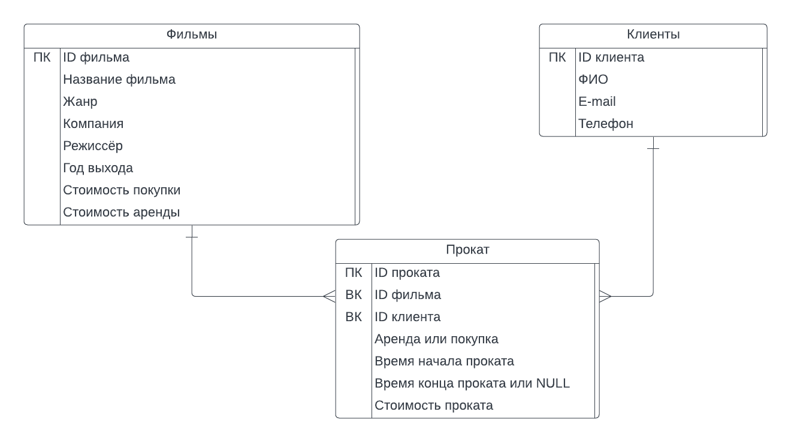

[//]: # (TODO: correct PNGs to include 'genre')

# Web-практикум: Видеопрокат (стриминг)

ВМК МГУ, 6 семестр

## Схема навигации:

\* С любой страницы можно вернуться на главную

## Описание страниц:
### Главная страница:
- Ссылка на список всех фильмов
- Кнопка для перехода к поиску фильмов
- Кнопка "Новый фильм"
- Ссылка на список всех клиентов
- Кнопка для перехода к поиску клиентов
- Кнопка "Новый клиент"
- Кнопка для перехода к поиску прокатов
### Страница поиска фильмов:
- Поле для ввода названия или ID
- Поля для поиска по компании, жанру, режиссёру, году выхода, стоимости покупки и аренды
- Кнопка "Применить и найти"
- Список фильмов и кнопки "О фильме" и "Редактировать" возле каждого пункта
### Страница фильма:
- Информация о фильме в виде списка атрибутов и их значений
- Кнопка "Редактировать"
- Кнопка "Удалить"
### Страница редактирования данных о фильме:
- Поля для изменения атрибутов фильма
- Кнопка "Сохранить"
### Страница поиска клиентов:
- Поле для ввода имени, ID, e-mail или телефона
- Кнопка "Найти"
- Список клиентов и кнопки "О клиенте" и "Редактировать" возле каждого пункта
### Страница клиента
- Информация о клиенте в виде списка атрибутов и их значений
- Кнопка "Редактировать"
- Кнопка "Удалить"
- Список всех прокатов клиента в хронологическом порядке
- Кнопка "Новый прокат"
### Страница редактирования данных о клиенте:
- Поля для изменения атрибутов клиента
- Кнопка "Сохранить"
### Страница добавления проката фильма:
- Имя клиента
- Dropdown-меню выбора фильма
- Кнопки для выбора значения "Покупка" или "Аренда"
- Поле для выбора даты и времени покупки или начала аренды
### Страница поиска прокатов:
- Два поля для выбора начала и конца периода поиска
- Кнопка "Найти"
- Список прокатов и кнопки "О фильме" и "О клиенте" возле каждого пункта

## Некоторые сценарии использования:
- Добавление фильма: Главная → Новый фильм → (ввести данные) → Сохранить
- Получение списка всех фильмов: Главная → Все фильмы
- Получение информации о фильме: Главная → Поиск фильма → (ввести название или ID) → О фильме
- Редактирование данных о фильме: Главная → Поиск фильма → (ввести название или ID) → Редактировать → Сохранить
- Добавление клиента: Главная → Новый клиент → (ввести данные) → Сохранить
- Получение списка всех клиентов: Главная → Все клиенты
- Получение информации о клиенте: Главная → Поиск клиента → (ввести имя или ID) → О клиенте
- Редактирование данных о клиенте: Главная → Поиск клиента → (ввести имя или ID) → Редактировать → Сохранить
- Получение списка прокатов за период: Главная → Поиск прокатов → (ввести период) → Найти

## Схема базы данных:

