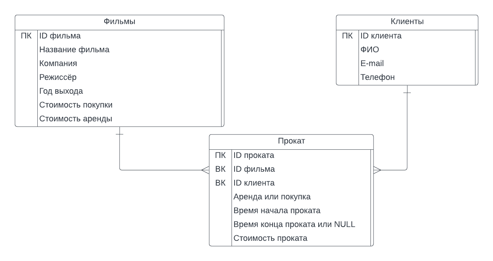

# Web-практикум: Видеопрокат (стриминг)

ВМК МГУ, 6 семестр

#### Схема навигации:

\* С любой страницы можно вернуться на главную

#### Некоторые сценарии использования:
- Добавление фильма: Главная → Новый фильм → (ввести данные) → Сохранить
- Получение списка всех фильмов: Главная → Все фильмы
- Получение информации о фильме: Главная → Поиск фильма → (ввести название, ID) → О фильме
- Редактирование данных о фильме: Главная → Поиск фильма → (ввести название, ID) → Редактировать → Сохранить
- Добавление клиента: Главная → Новый клиент → (ввести данные) → Сохранить
- Получение списка всех клиентов: Главная → Все клиенты
- Получение информации о клиенте: Главная → Поиск клиента → (ввести имя или ID) → О клиенте
- Редактирование данных о клиенте: Главная → Поиск клиента → (ввести имя или ID) → Редактировать → Сохранить
- Получение списка прокатов за период: Главная → Поиск прокатов → (ввести период) → Найти

#### Схема базы данных:

